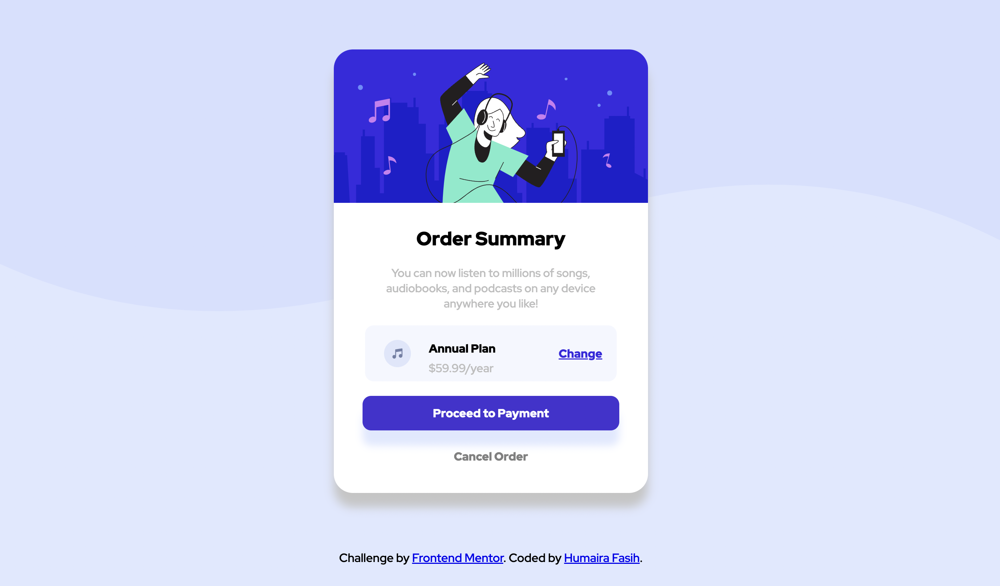
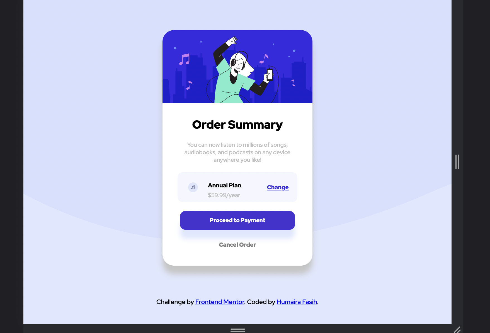
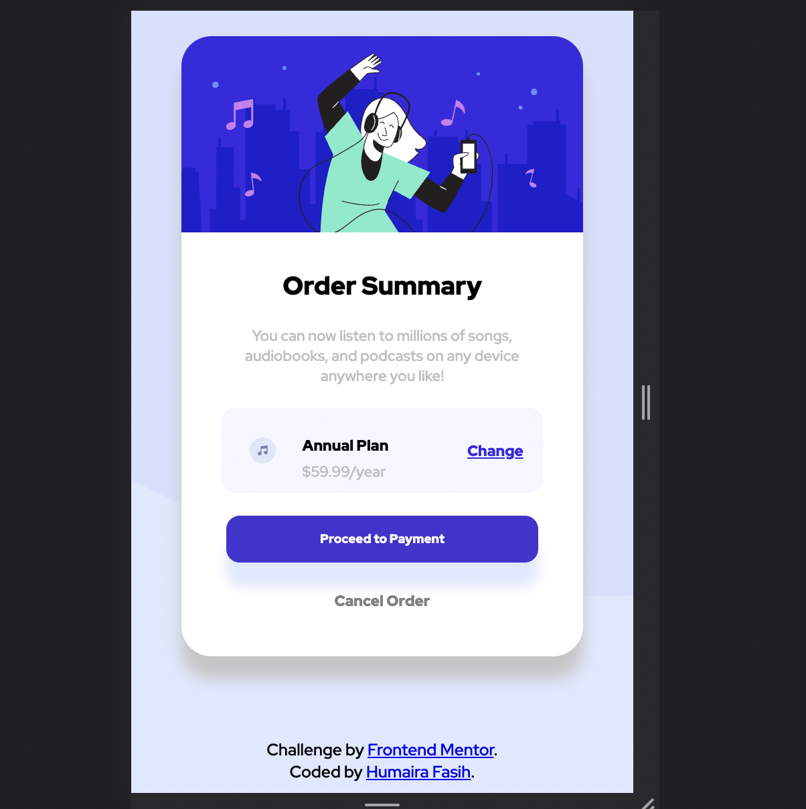

  
# Frontend Mentor - Order summary card solution

This is a solution to the [Order summary card challenge on Frontend Mentor](https://www.frontendmentor.io/challenges/order-summary-component-QlPmajDUj). 

## Table of contents

- [Overview](#overview)
  - [Objective](#objective)
  - [Screenshots](#screenshots)
- [Solution Link](#solution-link)
- [My process](#my-process)
  - [Tools and Technologies Used](#tools-and-technologies-used)
  - [Major Concepts I learned](#major-concepts-i-learned)
- [Future Plans](#future-plans)

## Overview
### Objective

The challenge:
- Reciprocate the design provided using Markup and styling (designs are present in the designs/ directory of the repository) 
- Allow users to be able to see hover states for interactive elements. 

### Screenshots
Result on standard Laptop screens (Slightly altered due to cropping)

Result on standard Tablet screens 
 

Result on standard Mobile screen 

**Disclaimer: The screenshots do not show the interactive elements' active states, please refer to the solution link to view them.**
## Solution Link 

The Project is hosted on GitHub Pages.  
[View Solution to Challenge](https://humairafasih.github.io/OrderSummaryCard/)

## My process

### Tools and Technologies Used

- Semantic HTML5 markup
- Flexbox
- CSS Grid
- Google Fonts
- Mobile-first workflow

### Major Concepts I Learned

Using CSS Flexbox and Grid to layer components smoothly was the biggest takeaway from this project. Attentiveness to detail was another crucial skill that I honed while working on the challenge.

## Future Plans

Understand more complex layouts using CSS Flexbox and Grid. Incorporate responsiveness using JS frameworks.

